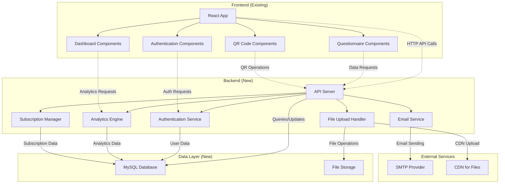

# Component Architecture

## New Components

### Backend API Server
**Responsibility:** Handle all HTTP requests, authentication, data persistence, and business logic  
**Integration Points:** Frontend API calls, database, email service, file storage

**Key Interfaces:**
- RESTful API endpoints matching frontend expectations
- JWT authentication middleware
- File upload handling for QR code logos
- Email notification service integration

**Dependencies:**
- **Existing Components:** Frontend React application (via API)
- **New Components:** Database models, authentication service, email service

**Technology Stack:** Node.js 18+, Express.js 4.x, Sequelize 6.x, JWT, bcrypt

### Authentication Service
**Responsibility:** User registration, login, password management, and session handling  
**Integration Points:** API server, database users table, email service

**Key Interfaces:**
- User registration with email verification
- Secure login with JWT tokens
- Password reset with email tokens
- Session management and token refresh

**Dependencies:**
- **Existing Components:** Frontend authentication components
- **New Components:** API server, email service, database models

**Technology Stack:** JWT, bcrypt, nodemailer, secure password policies

### Analytics Engine
**Responsibility:** Process response data into bubble-based analytics and measurable insights  
**Integration Points:** Database responses/answers, frontend dashboard components

**Key Interfaces:**
- Category-based analytics calculations
- Time-period comparison algorithms
- Bubble visualization data generation
- Export functionality for reports

**Dependencies:**
- **Existing Components:** Frontend dashboard and chart components
- **New Components:** Database models, API server

**Technology Stack:** Sequelize queries, data aggregation algorithms, caching layer

### Subscription Manager
**Responsibility:** Enforce plan limitations and manage subscription boundaries  
**Integration Points:** API server endpoints, database users table, frontend UI components

**Key Interfaces:**
- Real-time limitation checking
- Usage tracking and counting
- Plan upgrade prompts and notifications
- Manual subscription control interface

**Dependencies:**
- **Existing Components:** Frontend subscription UI components
- **New Components:** API server, database models

**Technology Stack:** Middleware interceptors, database counters, validation logic

### Email Notification Service
**Responsibility:** Send transactional emails for verification, alerts, and notifications  
**Integration Points:** Authentication service, API server, SMTP provider

**Key Interfaces:**
- Email template system
- Queue management for reliable delivery
- Delivery tracking and bounce handling
- Notification preference management

**Dependencies:**
- **Existing Components:** Frontend settings components
- **New Components:** Authentication service, API server

**Technology Stack:** Nodemailer, SMTP integration, email templates, queue system

## Component Interaction Diagram

