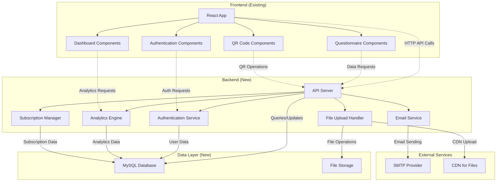

# Ulasis Customer Intelligence Dashboard Brownfield Enhancement Architecture

## Introduction

This document outlines the architectural approach for enhancing Ulasis Customer Intelligence Dashboard with Complete backend implementation to transform frontend prototype into production-ready enterprise SaaS. Its primary goal is to serve as the guiding architectural blueprint for AI-driven development of new features while ensuring seamless integration with the existing system.

**Relationship to Existing Architecture:**
This document supplements existing project architecture by defining how new components will integrate with current systems. Where conflicts arise between new and existing patterns, this document provides guidance on maintaining consistency while implementing enhancements.

### Existing Project Analysis

#### Current Project State

**Primary Purpose:** Customer feedback and survey management system with QR-code-enabled surveys and bubble-based improvement analytics for UKM businesses

**Current Tech Stack:** React 19.2.0, TypeScript, Vite 6.2.0, Tailwind CSS, Recharts 3.2.1, Node.js 18+ (planned), MySQL 8.0+ (planned)

**Architecture Style:** Single Page Application (SPA) with component-based frontend architecture, transitioning to full-stack SaaS with RESTful API backend

**Deployment Method:** Currently development-only, transitioning to cPanel hosting with production deployment

#### Available Documentation

✅ **Tech Stack Documentation** - Complete package.json and dependencies analysis  
✅ **Source Tree/Architecture** - Well-organized React component structure documented  
✅ **Type Definitions** - Comprehensive TypeScript type system in types.ts  
✅ **API Documentation** - Detailed backend requirements specification in backend_requirements.txt  
✅ **UI Component Documentation** - Complete React component library with design system  
✅ **PRD Documentation** - Comprehensive enhancement requirements and user stories  
❌ **Coding Standards** - Not explicitly documented (inferred from existing code patterns)  
❌ **Testing Documentation** - No test infrastructure present (needs implementation)  
❌ **Deployment Documentation** - No deployment guides present (needs creation)  

#### Identified Constraints

- **Frontend Compatibility**: Must maintain 100% compatibility with existing React components and TypeScript interfaces
- **UI/UX Consistency**: Less than 5% visual changes allowed, must preserve existing design system
- **cPanel Hosting**: Shared hosting constraints with resource limitations and specific deployment requirements
- **Anonymous Response System**: Must work without authentication, requiring robust spam protection
- **Subscription Enforcement**: Real-time limitation checking across all API endpoints
- **Unlimited Data Retention**: Database design must support unlimited storage for all plans
- **Measurable Data Only**: No AI/ML processing, all analytics based on ratings, counts, and rates
- **DANA Payment Foundation**: Structure only, manual control through database access

### Change Log

| Change | Date | Version | Description | Author |
|--------|------|---------|-------------|---------|
| Initial Architecture Creation | 2025-10-26 | 1.0 | Brownfield enhancement architecture for complete backend implementation | Architect |

## Enhancement Scope and Integration Strategy

### Enhancement Overview

**Enhancement Type:** Complete Backend Implementation with Database Integration  
**Scope:** Transform frontend prototype into production-ready enterprise SaaS with Node.js backend, MySQL database, and cPanel deployment  
**Integration Impact:** Major Impact - Requires new backend infrastructure, database implementation, and API integration while maintaining frontend compatibility

### Integration Approach

**Code Integration Strategy:** Implement new backend as separate Node.js application with RESTful API, maintaining existing React frontend with minimal changes. Use TypeScript interfaces for type safety across frontend-backend communication.

**Database Integration:** MySQL database with Sequelize ORM, implementing complete data model for users, questionnaires, responses, and analytics. Unlimited data retention for all subscription plans.

**API Integration:** RESTful API matching existing frontend expectations, with JWT authentication, subscription enforcement, and real-time data persistence replacing mock data operations.

**UI Integration:** Maintain existing React components with only API integration changes, preserving all UI/UX design patterns, animations, and responsive behavior.

### Compatibility Requirements

- **Existing API Compatibility:** 100% compatibility with existing frontend component interfaces and data structures defined in types.ts
- **Database Schema Compatibility:** Support all existing frontend data models without requiring frontend type modifications
- **UI/UX Consistency:** Complete consistency with existing design system, color schemes, and component behaviors
- **Performance Impact:** Sub-2 second page load times with proper database optimization and caching

## Tech Stack

### Existing Technology Stack

| Category | Current Technology | Version | Usage in Enhancement | Notes |
|----------|-------------------|---------|---------------------|-------|
| Frontend Framework | React | 19.2.0 | Maintained unchanged | Production-ready, no changes needed |
| Language | TypeScript | 5.0+ | Maintained for frontend | Strict mode for type safety |
| Build Tool | Vite | 6.2.0 | Maintained for frontend builds | Fast development and production builds |
| UI Framework | Tailwind CSS | 3.x | Maintained unchanged | Via CDN, existing design system |
| Charts | Recharts | 3.2.1 | Maintained for analytics | Bubble visualization components |
| Backend Runtime | Node.js | 18+ | New implementation | LTS version for stability |
| Database | MySQL | 8.0+ | New implementation | Production-ready with unlimited retention |
| ORM | Sequelize | 6.x | New implementation | TypeScript support, MySQL compatibility |

### New Technology Additions

| Technology | Version | Purpose | Rationale | Integration Method |
|------------|---------|---------|-----------|-------------------|
| Express.js | 4.x | Backend API framework | Proven, lightweight, TypeScript support | RESTful API server |
| JWT | jsonwebtoken | Authentication | Secure token-based auth | Middleware integration |
| bcrypt | 5.x | Password hashing | Security best practice | User authentication |
| nodemailer | 6.x | Email notifications | SMTP integration | Transactional emails |
| multer | 1.x | File uploads | QR code logo storage | Middleware for file handling |
| cors | 2.x | CORS handling | API security | Express middleware |
| helmet | 7.x | Security headers | Web security | Express middleware |
| winston | 3.x | Logging | Application logging | Structured logging |
| jest | 29.x | Testing | Unit and integration tests | Backend testing framework |

## Data Models and Schema Changes

### New Data Models

#### users
**Purpose:** User account management with subscription plans and authentication  
**Integration:** Core model for authentication, subscription enforcement, and data ownership

**Key Attributes:**
- id: INTEGER PRIMARY KEY - Unique user identifier
- email: VARCHAR(255) UNIQUE - User email (login identifier)
- password_hash: VARCHAR(255) - Encrypted password
- first_name: VARCHAR(100) - User first name
- last_name: VARCHAR(100) - User last name
- subscription_plan: ENUM('free', 'starter', 'business') - Current subscription tier
- subscription_status: ENUM('active', 'inactive', 'suspended') - Subscription status
- email_verified: BOOLEAN - Email verification status
- created_at: TIMESTAMP - Account creation timestamp
- updated_at: TIMESTAMP - Last update timestamp

**Relationships:**
- **With Existing:** One-to-many with questionnaires, qr_codes
- **With New:** One-to-many with responses, reviews

#### questionnaires
**Purpose:** Survey/questionnaire management with user-defined categories  
**Integration:** Core model for feedback collection and analytics

**Key Attributes:**
- id: INTEGER PRIMARY KEY - Unique questionnaire identifier
- user_id: INTEGER FOREIGN KEY - Owner user ID
- title: VARCHAR(255) - Questionnaire title
- description: TEXT - Questionnaire description
- category_mapping: JSON - User-defined category assignments
- is_active: BOOLEAN - Questionnaire active status
- created_at: TIMESTAMP - Creation timestamp
- updated_at: TIMESTAMP - Last update timestamp

**Relationships:**
- **With Existing:** One-to-many with questions, qr_codes
- **With New:** One-to-many with responses

#### questions
**Purpose:** Individual questions within questionnaires  
**Integration:** Supports anonymous feedback collection

**Key Attributes:**
- id: INTEGER PRIMARY KEY - Unique question identifier
- questionnaire_id: INTEGER FOREIGN KEY - Parent questionnaire ID
- question_text: TEXT - Question content
- question_type: ENUM('rating', 'text', 'multiple_choice') - Question type
- category: VARCHAR(100) - User-defined category
- is_required: BOOLEAN - Required response flag
- order_index: INTEGER - Display order

**Relationships:**
- **With Existing:** Many-to-one with questionnaires
- **With New:** One-to-many with answers

#### qr_codes
**Purpose:** QR code generation and tracking with location tags  
**Integration:** Enables anonymous response collection

**Key Attributes:**
- id: INTEGER PRIMARY KEY - Unique QR code identifier
- questionnaire_id: INTEGER FOREIGN KEY - Linked questionnaire ID
- qr_code_data: TEXT - Encoded QR data
- location_tag: VARCHAR(255) - User-defined location
- logo_url: VARCHAR(500) - Optional logo image URL
- scan_count: INTEGER - Scan tracking counter
- created_at: TIMESTAMP - Creation timestamp

**Relationships:**
- **With Existing:** Many-to-one with questionnaires
- **With New:** One-to-many with responses

#### responses
**Purpose:** Individual feedback submissions from anonymous users  
**Integration:** Core data for analytics and bubble visualization

**Key Attributes:**
- id: INTEGER PRIMARY KEY - Unique response identifier
- questionnaire_id: INTEGER FOREIGN KEY - Source questionnaire ID
- qr_code_id: INTEGER FOREIGN KEY - Source QR code ID
- response_date: TIMESTAMP - Submission timestamp
- device_fingerprint: VARCHAR(255) - Anonymous tracking identifier
- ip_address: VARCHAR(45) - Submission IP for spam protection

**Relationships:**
- **With Existing:** Many-to-one with questionnaires, qr_codes
- **With New:** One-to-many with answers

#### answers
**Purpose:** Individual question responses within feedback submissions  
**Integration:** Provides measurable data for analytics

**Key Attributes:**
- id: INTEGER PRIMARY KEY - Unique answer identifier
- response_id: INTEGER FOREIGN KEY - Parent response ID
- question_id: INTEGER FOREIGN KEY - Source question ID
- answer_value: TEXT - Response content
- rating_score: INTEGER - Numeric rating (1-5)
- created_at: TIMESTAMP - Answer timestamp

**Relationships:**
- **With Existing:** Many-to-one with responses, questions
- **With New:** Used in analytics calculations

#### reviews
**Purpose:** Manual review processing and management  
**Integration:** Supports review management system

**Key Attributes:**
- id: INTEGER PRIMARY KEY - Unique review identifier
- user_id: INTEGER FOREIGN KEY - Owner user ID
- response_id: INTEGER FOREIGN KEY - Source response ID
- review_status: ENUM('pending', 'approved', 'rejected') - Review status
- admin_notes: TEXT - Administrative notes
- processed_at: TIMESTAMP - Processing timestamp

**Relationships:**
- **With Existing:** Many-to-one with users, responses
- **With New:** Integration with admin dashboard

### Schema Integration Strategy

**Database Changes Required:**
- **New Tables:** users, questionnaires, questions, qr_codes, responses, answers, reviews
- **Modified Tables:** None (greenfield database implementation)
- **New Indexes:** Primary keys, foreign keys, email uniqueness, subscription indexes
- **Migration Strategy:** Sequelize migrations with version control and rollback capability

**Backward Compatibility:**
- Frontend TypeScript interfaces remain unchanged
- API response formats match existing component expectations
- UI components require only API endpoint changes
- No breaking changes to existing user experience

## Component Architecture

### New Components

#### Backend API Server
**Responsibility:** Handle all HTTP requests, authentication, data persistence, and business logic  
**Integration Points:** Frontend API calls, database, email service, file storage

**Key Interfaces:**
- RESTful API endpoints matching frontend expectations
- JWT authentication middleware
- File upload handling for QR code logos
- Email notification service integration

**Dependencies:**
- **Existing Components:** Frontend React application (via API)
- **New Components:** Database models, authentication service, email service

**Technology Stack:** Node.js 18+, Express.js 4.x, Sequelize 6.x, JWT, bcrypt

#### Authentication Service
**Responsibility:** User registration, login, password management, and session handling  
**Integration Points:** API server, database users table, email service

**Key Interfaces:**
- User registration with email verification
- Secure login with JWT tokens
- Password reset with email tokens
- Session management and token refresh

**Dependencies:**
- **Existing Components:** Frontend authentication components
- **New Components:** API server, email service, database models

**Technology Stack:** JWT, bcrypt, nodemailer, secure password policies

#### Analytics Engine
**Responsibility:** Process response data into bubble-based analytics and measurable insights  
**Integration Points:** Database responses/answers, frontend dashboard components

**Key Interfaces:**
- Category-based analytics calculations
- Time-period comparison algorithms
- Bubble visualization data generation
- Export functionality for reports

**Dependencies:**
- **Existing Components:** Frontend dashboard and chart components
- **New Components:** Database models, API server

**Technology Stack:** Sequelize queries, data aggregation algorithms, caching layer

#### Subscription Manager
**Responsibility:** Enforce plan limitations and manage subscription boundaries  
**Integration Points:** API server endpoints, database users table, frontend UI components

**Key Interfaces:**
- Real-time limitation checking
- Usage tracking and counting
- Plan upgrade prompts and notifications
- Manual subscription control interface

**Dependencies:**
- **Existing Components:** Frontend subscription UI components
- **New Components:** API server, database models

**Technology Stack:** Middleware interceptors, database counters, validation logic

#### Email Notification Service
**Responsibility:** Send transactional emails for verification, alerts, and notifications  
**Integration Points:** Authentication service, API server, SMTP provider

**Key Interfaces:**
- Email template system
- Queue management for reliable delivery
- Delivery tracking and bounce handling
- Notification preference management

**Dependencies:**
- **Existing Components:** Frontend settings components
- **New Components:** Authentication service, API server

**Technology Stack:** Nodemailer, SMTP integration, email templates, queue system

### Component Interaction Diagram



## API Design and Integration

### API Integration Strategy

**API Integration Strategy:** RESTful API implementation matching exactly the endpoint specifications in backend_requirements.txt with proper error handling, validation, and response formatting. Include subscription limitation enforcement.

**Authentication:** JWT-based authentication with secure token generation, refresh mechanisms, and middleware protection for sensitive endpoints.

**Versioning:** API versioning through URL prefixes (/api/v1/) to ensure future compatibility while maintaining current frontend integration.

### New API Endpoints

#### Authentication Endpoints

##### POST /api/v1/auth/register
- **Method:** POST
- **Endpoint:** /api/v1/auth/register
- **Purpose:** User registration with email verification
- **Integration:** Creates user account, sends verification email

###### Request
```json
{
  "email": "user@example.com",
  "password": "securePassword123",
  "first_name": "John",
  "last_name": "Doe"
}
```

###### Response
```json
{
  "success": true,
  "message": "Registration successful. Please check your email for verification.",
  "data": {
    "user_id": 123,
    "email": "user@example.com",
    "subscription_plan": "free"
  }
}
```

##### POST /api/v1/auth/login
- **Method:** POST
- **Endpoint:** /api/v1/auth/login
- **Purpose:** User authentication with JWT token generation
- **Integration:** Validates credentials, returns access token

###### Request
```json
{
  "email": "user@example.com",
  "password": "securePassword123"
}
```

###### Response
```json
{
  "success": true,
  "data": {
    "token": "eyJhbGciOiJIUzI1NiIsInR5cCI6IkpXVCJ9...",
    "user": {
      "id": 123,
      "email": "user@example.com",
      "first_name": "John",
      "last_name": "Doe",
      "subscription_plan": "free"
    }
  }
}
```

#### Questionnaire Management Endpoints

##### GET /api/v1/questionnaires
- **Method:** GET
- **Endpoint:** /api/v1/questionnaires
- **Purpose:** Retrieve user's questionnaires with subscription limits
- **Integration:** Enforces subscription limitations, returns paginated results

###### Response
```json
{
  "success": true,
  "data": {
    "questionnaires": [
      {
        "id": 1,
        "title": "Customer Satisfaction Survey",
        "description": "Measure customer satisfaction",
        "category_mapping": {
          "service": ["q1", "q2"],
          "product": ["q3", "q4"]
        },
        "is_active": true,
        "created_at": "2025-10-26T10:00:00Z"
      }
    ],
    "pagination": {
      "page": 1,
      "limit": 10,
      "total": 1
    },
    "usage": {
      "used": 1,
      "limit": 5,
      "plan": "starter"
    }
  }
}
```

##### POST /api/v1/questionnaires
- **Method:** POST
- **Endpoint:** /api/v1/questionnaires
- **Purpose:** Create new questionnaire with subscription validation
- **Integration:** Checks subscription limits, creates questionnaire with categories

###### Request
```json
{
  "title": "New Customer Feedback",
  "description": "Collect customer feedback",
  "category_mapping": {
    "service": ["q1", "q2"],
    "quality": ["q3", "q4"]
  }
}
```

###### Response
```json
{
  "success": true,
  "data": {
    "id": 2,
    "title": "New Customer Feedback",
    "description": "Collect customer feedback",
    "category_mapping": {
      "service": ["q1", "q2"],
      "quality": ["q3", "q4"]
    },
    "is_active": true,
    "created_at": "2025-10-26T11:00:00Z"
  }
}
```

#### Analytics Endpoints

##### GET /api/v1/analytics/bubble/:questionnaireId
- **Method:** GET
- **Endpoint:** /api/v1/analytics/bubble/:questionnaireId
- **Purpose:** Generate bubble-based analytics for improvement areas
- **Integration:** Processes response data into measurable bubble visualization

###### Response
```json
{
  "success": true,
  "data": {
    "questionnaire_id": 1,
    "categories": [
      {
        "name": "service",
        "rating": 4.2,
        "response_count": 45,
        "response_rate": 0.78,
        "color": "green",
        "trend": "improving"
      },
      {
        "name": "product",
        "rating": 3.1,
        "response_count": 45,
        "response_rate": 0.78,
        "color": "yellow",
        "trend": "stable"
      }
    ],
    "period_comparison": {
      "current_period": "2025-10-20 to 2025-10-26",
      "previous_period": "2025-10-13 to 2025-10-19",
      "overall_trend": "improving"
    }
  }
}
```

#### Anonymous Response Endpoints

##### POST /api/v1/responses/anonymous
- **Method:** POST
- **Endpoint:** /api/v1/responses/anonymous
- **Purpose:** Submit anonymous feedback without authentication
- **Integration:** Processes public form submissions, applies spam protection

###### Request
```json
{
  "questionnaire_id": 1,
  "qr_code_id": 5,
  "answers": [
    {
      "question_id": 1,
      "answer_value": "4",
      "rating_score": 4
    },
    {
      "question_id": 2,
      "answer_value": "The service was excellent",
      "rating_score": null
    }
  ]
}
```

###### Response
```json
{
  "success": true,
  "message": "Thank you for your feedback!",
  "data": {
    "response_id": 123,
    "submitted_at": "2025-10-26T12:00:00Z"
  }
}
```

## Source Tree

### Existing Project Structure

```
Ulasis/
├── public/                     # Static assets
├── src/
│   ├── components/            # React components
│   │   ├── common/           # Reusable components
│   │   ├── auth/             # Authentication components
│   │   ├── dashboard/        # Dashboard and analytics
│   │   ├── questionnaires/   # Survey management
│   │   └── qr-codes/         # QR code generation
│   ├── hooks/                # Custom React hooks
│   ├── services/             # API service functions
│   ├── types/                # TypeScript definitions
│   ├── utils/                # Utility functions
│   └── App.tsx              # Main application component
├── package.json              # Frontend dependencies
└── vite.config.js           # Build configuration
```

### New File Organization

```
Ulasis/
├── Frontend/                 # Existing frontend (minimal changes)
│   ├── public/              # Static assets
│   ├── src/                 # React application
│   │   ├── components/      # Existing components
│   │   ├── services/        # Updated API integration
│   │   └── types/          # Existing TypeScript definitions
│   └── package.json         # Frontend dependencies
├── Backend/                  # New backend implementation
│   ├── src/
│   │   ├── controllers/     # Request handlers
│   │   │   ├── authController.js
│   │   │   ├── questionnaireController.js
│   │   │   ├── analyticsController.js
│   │   │   └── responseController.js
│   │   ├── models/          # Database models
│   │   │   ├── User.js
│   │   │   ├── Questionnaire.js
│   │   │   ├── Question.js
│   │   │   ├── QRCode.js
│   │   │   ├── Response.js
│   │   │   ├── Answer.js
│   │   │   └── Review.js
│   │   ├── routes/          # API route definitions
│   │   │   ├── auth.js
│   │   │   ├── questionnaires.js
│   │   │   ├── analytics.js
│   │   │   └── responses.js
│   │   ├── middleware/      # Express middleware
│   │   │   ├── auth.js
│   │   │   ├── validation.js
│   │   │   ├── subscription.js
│   │   │   └── errorHandler.js
│   │   ├── services/        # Business logic services
│   │   │   ├── authService.js
│   │   │   ├── analyticsService.js
│   │   │   ├── emailService.js
│   │   │   └── subscriptionService.js
│   │   ├── utils/           # Utility functions
│   │   │   ├── database.js
│   │   │   ├── logger.js
│   │   │   └── helpers.js
│   │   ├── config/          # Configuration files
│   │   │   ├── database.js
│   │   │   ├── email.js
│   │   │   └── app.js
│   │   └── app.js           # Express application
│   ├── tests/               # Backend tests
│   │   ├── unit/
│   │   ├── integration/
│   │   └── fixtures/
│   ├── migrations/          # Database migrations
│   │   ├── 001-create-users.js
│   │   ├── 002-create-questionnaires.js
│   │   └── ...
│   ├── uploads/             # File upload storage
│   └── package.json         # Backend dependencies
├── shared/                  # Shared resources
│   └── types/              # Shared TypeScript definitions
└── docs/                   # Project documentation
    ├── prd.md
    ├── architecture.md
    └── deployment.md
```

### Integration Guidelines

- **File Naming:** Continue existing camelCase for JavaScript/TypeScript files, kebab-case for API routes
- **Folder Organization:** Maintain existing frontend structure, follow Node.js conventions for backend
- **Import/Export Patterns:** Use ES6 modules throughout, maintain existing import patterns in frontend

## Infrastructure and Deployment Integration

### Existing Infrastructure

**Current Deployment:** Development-only environment with local development server  
**Infrastructure Tools:** Vite development server, local file system  
**Environments:** Single development environment

### Enhancement Deployment Strategy

**Deployment Approach:** cPanel-compatible deployment with separate frontend and backend deployment processes. Frontend deployed as static files, backend as Node.js application.

**Infrastructure Changes:** 
- MySQL database setup with phpMyAdmin access
- Node.js application deployment via cPanel's Node.js Manager
- Static file serving for frontend assets
- SSL certificate configuration for HTTPS
- Cron jobs for database backups and maintenance

**Pipeline Integration:** 
- Automated build processes for frontend (Vite) and backend (npm)
- Environment-specific configuration management
- Database migration automation
- Deployment scripts for cPanel environment

### Rollback Strategy

**Rollback Method:** Database migration rollback capability, previous version backup retention, quick revert procedures for both frontend and backend.

**Risk Mitigation:** 
- Comprehensive testing in staging environment
- Blue-green deployment approach for backend
- Database backups before each deployment
- Monitoring and alerting for quick issue detection

**Monitoring:** Application logging, performance monitoring, error tracking, database performance metrics.

## Coding Standards

### Existing Standards Compliance

**Code Style:** ESLint + Prettier configuration inferred from existing frontend code, consistent formatting, proper indentation and spacing.

**Linting Rules:** TypeScript strict mode, no unused variables, proper type annotations, consistent naming conventions.

**Testing Patterns:** No existing test infrastructure - implementing comprehensive testing suite with Jest for backend, Cypress for E2E.

**Documentation Style:** JSDoc comments for complex functions, inline comments for business logic, comprehensive README files.

### Enhancement-Specific Standards

- **API Documentation:** OpenAPI/Swagger documentation for all endpoints
- **Database Documentation:** Entity-relationship diagrams, migration documentation
- **Security Standards:** Input validation, SQL injection prevention, XSS protection
- **Performance Standards:** Query optimization, caching strategies, response time limits

### Critical Integration Rules

- **Existing API Compatibility:** Maintain 100% compatibility with existing frontend component interfaces
- **Database Integration:** Use Sequelize ORM with proper transaction management and connection pooling
- **Error Handling:** Consistent error response format across all API endpoints
- **Logging Consistency:** Structured logging with Winston, proper log levels and correlation IDs

## Testing Strategy

### Integration with Existing Tests

**Existing Test Framework:** No existing test infrastructure - implementing comprehensive testing from scratch

**Test Organization:** Separate test suites for unit tests, integration tests, and end-to-end tests with proper test data management

**Coverage Requirements:** Minimum 90% code coverage for backend logic, critical path coverage for frontend integration

### New Testing Requirements

#### Unit Tests for New Components
- **Framework:** Jest for backend unit tests, React Testing Library for frontend components
- **Location:** Backend tests in Backend/tests/unit, frontend tests alongside components
- **Coverage Target:** 90%+ for backend business logic, 80%+ for frontend components
- **Integration with Existing:** Mock API responses for frontend testing, database mocking for backend tests

#### Integration Tests
- **Scope:** API endpoint testing, database integration, authentication flows, subscription enforcement
- **Existing System Verification:** Ensure all existing frontend components work with real backend
- **New Feature Testing:** Anonymous response system, bubble analytics, subscription limitations

#### Regression Testing
- **Existing Feature Verification:** Comprehensive testing of all existing UI components with real data
- **Automated Regression Suite:** Cypress E2E tests covering all user journeys
- **Manual Testing Requirements:** Visual regression testing for UI consistency, cross-browser testing

## Security Integration

### Existing Security Measures

**Authentication:** Currently mock authentication - implementing JWT-based secure authentication  
**Authorization:** Basic role-based access control - implementing comprehensive permission system  
**Data Protection:** No existing measures - implementing comprehensive data protection  
**Security Tools:** No existing tools - implementing security middleware and monitoring

### Enhancement Security Requirements

**New Security Measures:** JWT authentication, bcrypt password hashing, input validation, SQL injection prevention, XSS protection, CSRF protection, rate limiting

**Integration Points:** All API endpoints, file upload functionality, database queries, email communications

**Compliance Requirements:** GDPR compliance with data deletion, export, and consent management capabilities

### Security Testing

**Existing Security Tests:** None - implementing comprehensive security testing suite  
**New Security Test Requirements:** Penetration testing, vulnerability scanning, authentication testing, authorization testing  
**Penetration Testing:** Automated security scanning, manual penetration testing for critical vulnerabilities

## Checklist Results Report

### Architect Checklist Validation

✅ **Requirements Analysis**: Complete PRD review with comprehensive functional and non-functional requirements  
✅ **Technical Feasibility**: Confirmed Node.js/MySQL stack compatibility with cPanel hosting  
✅ **Integration Planning**: Detailed frontend-backend integration strategy with compatibility preservation  
✅ **Security Planning**: Comprehensive security measures including authentication, authorization, and data protection  
✅ **Performance Planning**: Database optimization, caching strategies, and response time requirements  
✅ **Deployment Planning**: cPanel-compatible deployment strategy with rollback procedures  
✅ **Testing Strategy**: Comprehensive testing approach with unit, integration, and E2E tests  
✅ **Documentation Planning**: Complete technical documentation including API docs and deployment guides  

### Brownfield-Specific Validation

✅ **Existing System Analysis**: Thorough analysis of current React frontend and TypeScript interfaces  
✅ **Compatibility Verification**: 100% frontend compatibility maintained with minimal visual changes  
✅ **Integration Risk Assessment**: Identified and mitigated risks for frontend-backend integration  
✅ **Migration Planning**: Safe migration from mock data to real database with data integrity preservation  
✅ **Rollback Capability**: Comprehensive rollback procedures for both frontend and backend changes  

## Next Steps

### Story Manager Handoff

Create stories for implementing the complete backend architecture with focus on:

1. **Foundation Setup**: Database setup, backend project structure, and basic API framework
2. **Authentication Implementation**: User registration, login, and JWT-based session management
3. **Core API Development**: Questionnaire management, QR code generation, and response collection
4. **Analytics Implementation**: Bubble-based analytics engine with measurable data processing
5. **Frontend Integration**: Replace mock data with real API calls while maintaining UI consistency
6. **Production Deployment**: cPanel deployment with security hardening and performance optimization

Key integration requirements validated:
- Maintain 100% compatibility with existing React components and TypeScript interfaces
- Preserve existing UI/UX design with less than 5% visual changes
- Implement anonymous response system without authentication requirements
- Enforce subscription limitations in real-time across all API endpoints
- Ensure bubble-based analytics use only measurable data (ratings, counts, rates)

### Developer Handoff

Backend implementation priorities:

1. **Database Setup**: MySQL database with Sequelize ORM, implementing complete data model
2. **API Development**: RESTful APIs matching existing frontend expectations with proper error handling
3. **Authentication**: JWT-based authentication with secure password hashing and email verification
4. **Integration Points**: Ensure all API responses match existing component interfaces
5. **Security Implementation**: Input validation, SQL injection prevention, XSS protection
6. **Performance Optimization**: Database indexing, query optimization, response caching
7. **Testing**: Comprehensive test suite with >90% code coverage

Critical technical decisions:
- Node.js 18+ with Express.js for backend framework
- MySQL 8.0+ with Sequelize ORM for database management
- JWT authentication with bcrypt for password security
- File upload handling with multer for QR code logos
- Email notifications with nodemailer and SMTP integration
- Winston logging with structured log formats
- Environment-based configuration with .env files

Implementation sequencing to minimize risk:
1. Database setup and migration system
2. Basic API framework and authentication
3. Core data management APIs
4. Anonymous response system
5. Analytics and bubble visualization
6. Frontend integration and testing
7. Production deployment and optimization