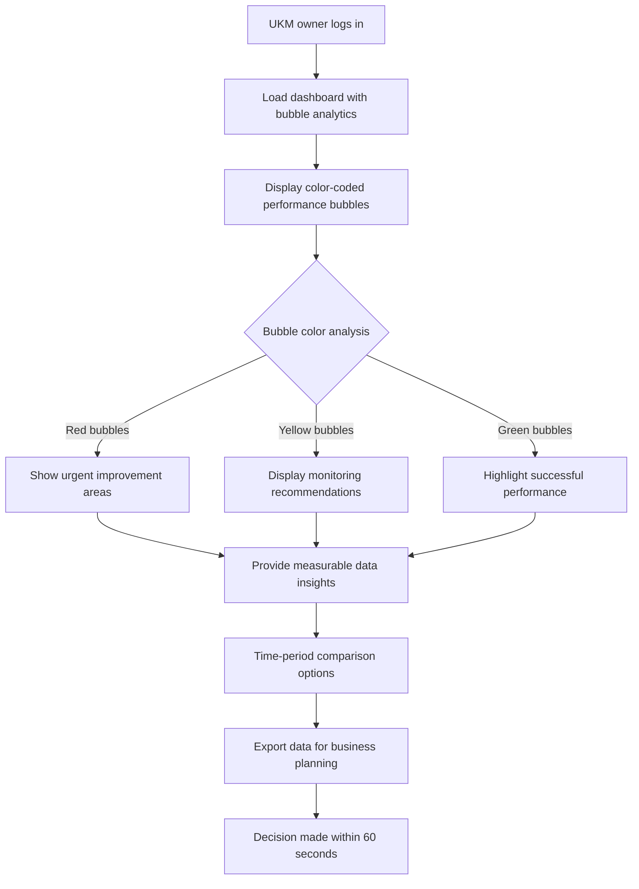
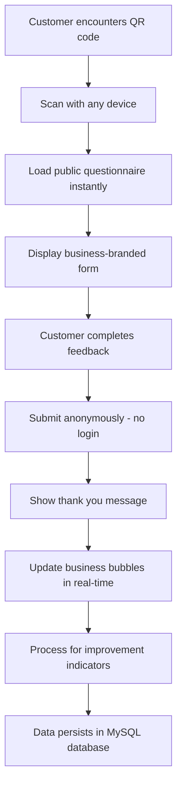
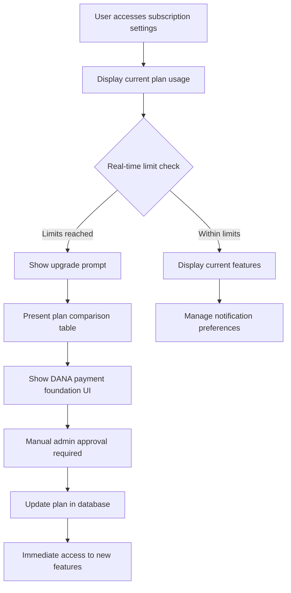
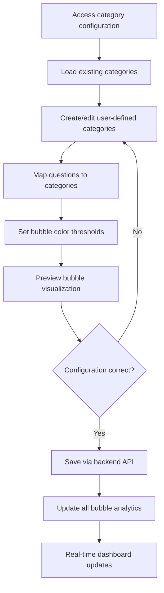

# Ulasis Customer Intelligence Dashboard UI/UX Specification

## Introduction

This document defines the user experience goals, information architecture, user flows, and visual design specifications for Ulasis Customer Intelligence Dashboard's user interface. It serves as the foundation for visual design and frontend development, ensuring a cohesive and user-centered experience.

### Overall UX Goals & Principles

#### Target User Personas

Based on the PRD's focus on UKM (Indonesian Small/Medium Businesses), the primary personas are:

1. **UKM Business Owner/Decision Maker:**
   - Needs: Quick, actionable insights for business improvement
   - Technical skill: Basic to intermediate computer literacy
   - Goals: Increase customer satisfaction, drive business growth
   - Constraints: Limited time, needs simple decision-making tools

2. **UKM Operations Staff:**
   - Needs: Easy feedback collection and QR code management
   - Technical skill: Basic smartphone/computer usage
   - Goals: Efficient daily operations, customer engagement
   - Constraints: Multi-tasking, needs intuitive interfaces

3. **End Customer (Feedback Provider):**
   - Needs: Simple, quick way to provide feedback
   - Technical skill: Varies widely, must work for everyone
   - Goals: Share opinions easily, anonymous preferred
   - Constraints: Limited patience, needs mobile-friendly experience

#### Usability Goals

1. **Decision-Making Speed:** UKM owners must understand business performance and make decisions within 60 seconds using bubble-based improvement indicators
2. **Zero-Friction Feedback:** Customers can provide feedback in under 2 minutes without authentication
3. **Real-Time Clarity:** All data updates and visualizations reflect current business state immediately
4. **Plan Limitation Transparency:** Users clearly understand subscription boundaries and upgrade paths

#### Design Principles

1. **Preserve Existing UI:** Maintain <5% visual changes to current design (NFR1 requirement)
2. **Measurable Data Only:** All visualizations based on ratings, response counts, response rates (FR6 requirement)
3. **Bubble-First Analytics:** Color-coded bubbles (red/yellow/green) as primary decision-making tool (NFR9 requirement)
4. **Anonymous-First Collection:** QR code feedback without authentication barriers (FR7 requirement)
5. **Mobile-Accessible Design:** Critical functions work on smartphones for on-the-go UKM owners

### Change Log

| Date | Version | Description | Author |
|------|---------|-------------|---------|
| 2025-10-26 | 1.0 | Initial PRD-driven UI/UX specification | UX Expert |

## Information Architecture (IA)

### Site Map / Screen Inventory

```mermaid
graph TD
    A[Public Access - No Auth Required] --> B[QR Code Response Collection]
    A --> C[Landing & Marketing Pages]
    
    B --> B1[Public Questionnaire View]
    B --> B2[Thank You/Confirmation]
    B --> B3[Error Handling for Invalid Codes]
    
    C --> C1[Features & Benefits]
    C --> C2[Pricing Plans]
    C --> C3[About/Contact]
    
    D[Authenticated Application] --> E[Core Dashboard - Bubble Analytics]
    D --> F[Feedback Management]
    D --> G[Analytics & Reporting]
    D --> H[Business Settings]
    
    E --> E1[Bubble-Based Performance Overview]
    E --> E2[Real-Time KPI Cards]
    E --> E3[Improvement Area Alerts]
    E --> E4[Quick Actions for UKM Decisions]
    
    F --> F1[Questionnaire Management]
    F --> F2[QR Code Generation & Tracking]
    F --> F3[Response Inbox/Review Management]
    F --> F4[User-Defined Category Configuration]
    
    G --> G1[Time-Period Comparison Analytics]
    G --> G2[Detailed Bubble Analytics Drill-Down]
    G --> G3[Data Export - CSV/Excel - Paid Plans]
    G --> G4[Custom Date Range Reports]
    
    H --> H1[Subscription Management - Real-Time Limits]
    H --> H2[DANA Payment Foundation UI]
    H --> H3[Email Notification Preferences]
    H --> H4[Profile & Business Information]
    
    I[Admin System - Enterprise Features] --> J[User Management]
    I --> K[System Monitoring]
    I --> L[Subscription Control - Manual DANA]
    I --> M[Backup & Recovery]
```

### Navigation Structure

**Primary Navigation:** 
- Dashboard (Bubble analytics focus - supports FR6, NFR9)
- Questionnaires (User-defined categories - supports FR6)
- QR Codes (Anonymous collection - supports FR7)
- Analytics (Time-period comparison - supports FR9)
- Reports (Data export - supports FR12)
- Settings (Subscription & DANA - supports FR8, FR10)

**Secondary Navigation:**
- Within Analytics: Overview | Time Comparison | Bubble Details | Export
- Within Settings: Profile | Subscription | Notifications | DANA Payment

**Breadcrumb Strategy:**
- Minimal due to flat navigation structure
- "Back" buttons in multi-step flows (Questionnaire Builder, QR Code Generation)
- Clear indication of subscription plan limitations throughout

## User Flows

### Flow 1: UKM Business Decision-Making with Bubble Analytics

**Supports PRD Requirements:** FR6 (Bubble-based analytics), NFR9 (Color-coded indicators), FR9 (Time-period comparison)

**User Goal:** UKM business owner makes data-driven decisions within 60 seconds using bubble-based improvement indicators

**Entry Points:** 
- Daily dashboard login routine
- Email notification alerts for performance changes
- Mobile access during business operations

**Success Criteria (PRD Acceptance):**
- Bubble visualization immediately shows red/yellow/green performance (NFR9)
- Uses only measurable data (ratings, response counts, response rates) - FR6
- Supports time-period comparison (week-over-week, custom ranges) - FR9
- Sub-2 second load times for decision speed - NFR2

#### Flow Diagram

#### Edge Cases & Error Handling

- No data available → Show setup guidance with sample bubble visualization
- Slow loading → Progressive bubble loading with skeleton states
- Subscription limits reached → Clear upgrade prompts with bubble preview
- Real-time data updates → Bubbles update without page refresh

### Flow 2: Anonymous Customer Feedback Collection via QR Code

**Supports PRD Requirements:** FR7 (Anonymous response collection), FR4 (Real-time persistence), NFR10 (No authentication required)

**User Goal:** Customer provides feedback seamlessly without login barriers

**Entry Points:**
- Physical QR codes at business locations
- Digital QR codes via WhatsApp/social media
- Direct links from marketing materials

**Success Criteria (PRD Acceptance):**
- Zero authentication requirements - NFR10
- Real-time dashboard updates - FR4
- Works on any device without app installation
- Spam protection and rate limiting (Integration Risks)

#### Flow Diagram

#### Edge Cases & Error Handling

- Invalid QR code → Friendly error with business contact info
- Network issues → Local storage retry mechanism
- Duplicate submission → Time-based prevention
- Mobile compatibility → Responsive design for all screen sizes

### Flow 3: Subscription Management with Real-Time Limitations

**Supports PRD Requirements:** FR8 (Subscription management), FR10 (DANA payment foundation), NFR11 (Real-time enforcement)

**User Goal:** UKM business manages subscription plan with clear upgrade paths and manual payment control

**Entry Points:**
- Settings → Subscription section
- Upgrade prompts when limits reached
- Admin dashboard for plan changes

**Success Criteria (PRD Acceptance):**
- Real-time limitation enforcement - NFR11
- Clear plan boundaries: Free (1Q/50R), Starter (5Q/500R), Business (unlimited) - FR8
- DANA payment foundation UI components - FR10
- Manual subscription control through database access

#### Flow Diagram

#### Edge Cases & Error Handling

- Payment processing errors → Clear error messages with retry options
- Plan downgrade → Data retention policies explanation
- Admin approval delay → Temporary feature access with notifications
- Subscription expiry → Grace period with data preservation

### Flow 4: User-Defined Category Configuration for Bubble Analytics

**Supports PRD Requirements:** FR6 (User-defined categories), FR1 (Backend API integration), CR1 (Frontend compatibility)

**User Goal:** Business staff configures custom categories that drive bubble analytics

**Entry Points:**
- Questionnaire Builder → Category Setup
- Settings → Analytics Configuration
- Dashboard quick setup for new users

**Success Criteria (PRD Acceptance):**
- Categories map to bubble visualization colors
- Measurable data only (no AI/ML processing)
- Real-time API integration with backend
- Maintains existing component interfaces

#### Flow Diagram

#### Edge Cases & Error Handling

- Invalid category names → Real-time validation with suggestions
- Too many categories → Performance impact warnings
- API errors → Local storage backup with sync retry
- Bubble threshold conflicts → Automatic color distribution

## Wireframes & Mockups Strategy

Given the PRD's strict constraint of maintaining <5% visual changes (NFR1), the wireframes and mockups strategy focuses on integration points rather than redesign.

### Design Strategy (PRD Constraint-Driven)

**Primary Design Files:** 
- Existing React component library in `/Ulasis/Frontend/components/`
- Maintain current Tailwind CSS class structure and design system
- Reference existing component interfaces in `types.ts`

### Key Enhancement Areas (Within <5% Change Constraint)

#### Screen 1: Enhanced Dashboard with Bubble Analytics Integration

**Purpose:** Integrate bubble-based analytics while preserving existing dashboard layout

**Key Elements:**
- **Preserve:** Existing KPI cards, trend charts, guidance system layout
- **Enhance:** Add bubble visualization overlay to existing analytics section
- **Integrate:** Real-time data indicators replacing mock data
- **Maintain:** Dark/light theme compatibility and responsive design

**Interaction Notes:**
- Bubbles are clickable for drill-down into time-period comparison
- Hover states show detailed metrics (ratings, response counts, response rates)
- Color transitions animate when performance changes (red/yellow/green)
- Mobile: Bubbles stack vertically with horizontal scrolling

**Design File Reference:** Existing `Dashboard.tsx` component with bubble integration

#### Screen 2: Enhanced Public Questionnaire View

**Purpose:** Enable anonymous feedback collection with real backend integration

**Key Elements:**
- **Preserve:** Existing form layout, question types, styling
- **Enhance:** Add real-time validation and submission feedback
- **Integrate:** QR code branding options for business customization
- **Maintain:** Mobile-first responsive design

**Interaction Notes:**
- Form submission shows real-time progress indicator
- Thank you message includes business branding and follow-up options
- Error states provide clear retry mechanisms
- No authentication barriers as per FR7 requirement

**Design File Reference:** Existing `PublicQuestionnaireView.tsx` with backend integration

#### Screen 3: Subscription Management with DANA Payment Foundation

**Purpose:** Display subscription limitations and DANA payment UI (manual control)

**Key Elements:**
- **Preserve:** Existing settings layout and navigation
- **Enhance:** Add real-time usage indicators and upgrade prompts
- **Integrate:** DANA payment foundation UI components
- **Maintain:** Plan comparison table and feature lists

**Interaction Notes:**
- Real-time usage meters update as limits are approached
- Upgrade prompts appear when limits are reached (NFR11)
- DANA payment UI is present but routes to manual admin approval
- Clear feature differentiation between Free/Starter/Business plans

**Design File Reference:** Existing `Settings.tsx` with subscription management integration

#### Screen 4: Admin Dashboard for System Management

**Purpose:** New interface for user management and manual subscription control

**Key Elements:**
- **New:** Admin-only interface following existing design patterns
- **Integrate:** User management, system monitoring, subscription control
- **Maintain:** Consistent styling with main application
- **Follow:** Existing component architecture and dark/light theme

**Interaction Notes:**
- Manual subscription changes require confirmation
- System health indicators show real-time status
- User management includes bulk operations
- Backup and restore controls with scheduling options

**Design File Reference:** New admin components following existing design system

## Component Library / Design System

### Design System Approach

**Preserve and Enhance Existing System:** Maintain the current Tailwind CSS-based design system with dark/light theme support, focusing integration efforts on backend data connectivity rather than visual redesign.

### Core Components (Existing + Enhancement Integration)

#### Component: Dashboard (Dashboard.tsx)

**Purpose:** Main business intelligence interface with bubble analytics integration

**Variants:**
- **Existing:** KPI cards, trend charts, guidance system
- **Enhanced:** Bubble visualization overlay, real-time data indicators

**States:**
- Loading: Skeleton states for all data components
- Error: Fallback displays with retry options
- Success: Full data display with bubble animations
- Empty: Setup guidance for new users

**Usage Guidelines:**
- Preserve existing layout structure and animations
- Add bubble visualization as additional layer, not replacement
- Maintain responsive grid system and dark/light theme compatibility

#### Component: Analytics (Analytics.tsx)

**Purpose:** Detailed analytics with bubble-based improvement indicators

**Variants:**
- **Existing:** Sentiment distribution, topic analysis, review sources
- **Enhanced:** Bubble drill-down, time-period comparison, export functionality

**States:**
- Subscription-limited: Upgrade overlays for Free plan users
- Data-loading: Progressive chart rendering
- Export-ready: CSV/Excel download options for paid plans

**Usage Guidelines:**
- Maintain existing chart library (Recharts) integration
- Add bubble visualization as complementary to existing charts
- Preserve subscription limitation patterns with upgrade prompts

#### Component: QuestionnaireBuilder (QuestionnaireBuilder.tsx)

**Purpose:** Form creation with user-defined category mapping

**Variants:**
- **Existing:** Question types, drag-drop interface, preview
- **Enhanced:** Category assignment, bubble threshold configuration

**States:**
- Subscription-limited: Questionnaire count restrictions
- Category-setup: Wizard for defining improvement areas
- Preview-with-bubbles: Show how responses map to bubble colors

**Usage Guidelines:**
- Preserve existing question types and interface patterns
- Add category mapping as additional question property
- Maintain real-time validation and error handling

#### Component: PublicQuestionnaireView (PublicQuestionnaireView.tsx)

**Purpose:** Anonymous feedback collection interface

**Variants:**
- **Existing:** Form display, validation, submission
- **Enhanced:** Real-time submission, QR branding, thank you customization

**States:**
- Loading: Form initialization with business branding
- Submitting: Progress indicators and confirmation
- Success: Branded thank you with follow-up options
- Error: Retry mechanisms with clear error messages

**Usage Guidelines:**
- Maintain mobile-first responsive design
- Ensure zero authentication barriers
- Add real-time backend integration without changing UI

#### Component: Settings (Settings.tsx)

**Purpose:** Business configuration and subscription management

**Variants:**
- **Existing:** Profile, preferences, basic settings
- **Enhanced:** Subscription management, DANA payment UI, notification preferences

**States:**
- Current-plan: Display features and limitations
- Upgrade-prompt: Clear comparison and upgrade paths
- Payment-processing: DANA payment foundation interface
- Admin-controls: Additional options for system administrators

**Usage Guidelines:**
- Preserve existing settings layout and navigation
- Add subscription management as new section
- Maintain dark/light theme and responsive design

#### New Component: BubbleVisualization

**Purpose:** Core bubble-based analytics display (New component following existing patterns)

**Variants:**
- Overview: Main dashboard bubble display
- Drill-down: Detailed bubble analysis with time comparison
- Mobile: Stacked vertical bubble layout

**States:**
- Loading: Animated bubble appearance
- Interactive: Hover states with detailed metrics
- Animated: Color transitions for performance changes
- Export-ready: Data preparation for CSV/Excel export

**Usage Guidelines:**
- Follow existing component architecture and styling patterns
- Use established color scheme (red/yellow/green for performance)
- Maintain accessibility and responsive design standards

## Branding & Style Guide

### Visual Identity

**Brand Guidelines:** Preserve existing Ulasis brand identity as implemented in current component library

### Color Palette (Existing - Must Be Maintained)

| Color Type | Hex Code | Usage |
|------------|-----------|-------|
| Primary | #007A7A | Brand primary, buttons, links, accents |
| Secondary | #004D4D | Darker brand variant, hover states |
| Accent | #FFC107 | Highlights, warnings, attention points |
| Success | #22c55e | Positive feedback, confirmations, good performance |
| Warning | #f59e0b | Cautions, monitoring indicators, yellow bubbles |
| Error | #ef4444 | Errors, destructive actions, red bubbles |
| Neutral | slate-50 to slate-900 | Text, borders, backgrounds, dark/light theme |

**Bubble Analytics Color Coding (PRD Requirement NFR9):**
- **Red (#ef4444):** Urgent improvement areas requiring immediate attention
- **Yellow (#f59e0b):** Monitor areas needing observation
- **Green (#22c55e):** Good performance areas to maintain

### Typography (Existing - Must Be Maintained)

**Font Families:**
- **Primary:** System UI fonts (default browser fonts)
- **Secondary:** Monospace for code/data displays
- **Monospace:** System monospace for technical displays

**Type Scale:**
| Element | Size | Weight | Line Height |
|---------|-------|--------|-------------|
| H1 | 2rem | Bold | 1.2 |
| H2 | 1.5rem | Semibold | 1.3 |
| H3 | 1.25rem | Semibold | 1.4 |
| Body | 1rem | Normal | 1.5 |
| Small | 0.875rem | Normal | 1.4 |

### Iconography (Existing - Must Be Maintained)

**Icon Library:** Custom SVG icon library in `Icons.tsx` (95+ icons)
**Usage Guidelines:** 
- Consistent stroke width (2px) and styling
- Dark/light theme compatible
- Hover and active states with color transitions
- Accessibility with proper ARIA labels

### Spacing & Layout (Existing - Must Be Maintained)

**Grid System:** Tailwind CSS responsive grid (12-column)
**Spacing Scale:** Tailwind CSS spacing scale (4px base unit)
- Padding/Margins: 0.5rem to 8rem (8px to 128px)
- Component spacing: 1rem to 2rem (16px to 32px)
- Section spacing: 4rem to 8rem (64px to 128px)

### Animation & Transitions (Existing - Must Be Maintained)

**Motion Principles:**
- Fade-in animations with staggered delays
- Hover states with smooth color transitions
- Loading states with skeleton animations
- Bubble animations for performance changes

**Key Animations:**
- **Fade-in-up:** Main content appearance (0.5s ease-out)
- **Fade-in-up-delay-1:** Staggered content (0.7s ease-out)
- **Fade-in-up-delay-2:** Further staggered content (0.9s ease-out)
- **Hover transitions:** Color and transform changes (0.2s ease-in-out)

### Dark/Light Theme (Existing - Must Be Maintained)

**Theme System:** 
- CSS custom properties for theme switching
- Automatic system preference detection
- Manual theme toggle with persistence
- Consistent color ratios across themes

**Theme Colors:**
- **Light:** Slate color palette with white backgrounds
- **Dark:** Slate color palette with slate-800/900 backgrounds
- **Brand colors:** Consistent across both themes

### Responsive Design (Existing - Must Be Maintained)

**Breakpoints:**
- **Mobile:** < 640px (sm)
- **Tablet:** 640px - 1024px (sm to lg)
- **Desktop:** 1024px - 1280px (lg to xl)
- **Wide:** > 1280px (xl)

**Adaptation Patterns:**
- Mobile: Single column, stacked navigation
- Tablet: Two-column layouts, horizontal scrolling
- Desktop: Multi-column grids, full navigation
- Wide: Maximum content width with centered layout

## Accessibility Requirements

### Compliance Target

**Standard:** WCAG 2.1 AA compliance with consideration for Indonesian digital accessibility guidelines

### Key Requirements

**Visual:**
- **Color contrast ratios:** Minimum 4.5:1 for normal text, 3:1 for large text (existing slate color palette meets these standards)
- **Focus indicators:** Visible 2px outline with brand color (#007A7A) for all interactive elements
- **Text sizing:** Support for 200% zoom without loss of functionality
- **Color independence:** Bubble analytics must convey information through more than just color (patterns, icons, text labels)

**Interaction:**
- **Keyboard navigation:** Complete functionality accessible via Tab, Enter, Space, Arrow keys
- **Screen reader support:** Proper ARIA labels for all interactive elements, especially bubble visualizations
- **Touch targets:** Minimum 44px × 44px for all interactive elements (critical for mobile QR code scanning)
- **Gesture alternatives:** All swipe/drag gestures have keyboard alternatives

**Content:**
- **Alternative text:** Descriptive alt text for all meaningful images and icons
- **Heading structure:** Proper h1-h6 hierarchy for screen reader navigation
- **Form labels:** Explicit labels associated with all form controls
- **Error messages:** Accessible error announcements with clear correction guidance

### Specific Implementation Requirements

#### Bubble Analytics Accessibility:
- **Screen reader support:** "Red bubble: Customer service - urgent improvement needed, 2.3 rating, 45 responses"
- **Keyboard navigation:** Arrow keys to navigate between bubbles, Enter to drill down
- **High contrast mode:** Bubble patterns (dots, lines) in addition to colors
- **Text labels:** Performance indicators visible as text within/near bubbles

#### Anonymous Form Accessibility:
- **QR code accessibility:** Alternative text explaining QR code purpose and scanning instructions
- **Form navigation:** Logical tab order through questionnaire questions
- **Input validation:** Clear, accessible error messages with correction suggestions
- **Submission feedback:** Screen reader announcement of successful submission

#### Subscription Management Accessibility:
- **Plan comparison:** Accessible table with proper headers and descriptions
- **Usage indicators:** Text-based progress indicators in addition to visual meters
- **Upgrade prompts:** Clear explanation of features and limitations
- **DANA payment UI:** Accessible payment form with proper error handling

#### Mobile Accessibility Considerations:
- **Touch target spacing:** Minimum 8px between interactive elements
- **Responsive text:** Text remains readable at mobile sizes without horizontal scrolling
- **Gesture simplicity:** Simple taps for primary actions, complex gestures optional
- **Orientation support:** Full functionality in both portrait and landscape

### Testing Strategy

- **Automated testing:** Axe DevTools integration in CI/CD pipeline
- **Screen reader testing:** NVDA (Windows), VoiceOver (Mac), TalkBack (Android)
- **Keyboard testing:** Complete functionality without mouse
- **Mobile testing:** Voice access, switch navigation, zoom functionality
- **User testing:** Include users with disabilities in Indonesian UKM context

## Responsiveness Strategy

### Breakpoints (Existing - Must Be Maintained)

| Breakpoint | Min Width | Max Width | Target Devices |
|------------|------------|------------|----------------|
| Mobile | 320px | 639px | Smartphones, small tablets |
| Tablet | 640px | 1023px | Tablets, large phones landscape |
| Desktop | 1024px | 1279px | Laptops, small desktops |
| Wide | 1280px | - | Large desktops, external monitors |

### Indonesian Market Device Considerations

- **Mobile dominant:** High smartphone usage for business operations
- **Variable network:** 3G/4G connectivity with varying speeds
- **Device diversity:** Range from budget Android to iOS devices
- **Business context:** Owners often manage operations while on-the-go

### Adaptation Patterns

**Layout Changes:**
- **Mobile:** Single column layout, collapsible sidebar navigation, stacked KPI cards
- **Tablet:** Two-column layouts, horizontal scrolling for analytics, persistent sidebar
- **Desktop:** Multi-column grid layouts, full sidebar navigation, maximum data density
- **Wide:** Optimal content width with enhanced data visualization

**Navigation Changes:**
- **Mobile:** Hamburger menu with slide-out navigation, bottom tab bar for key actions
- **Tablet:** Icon-based sidebar with text labels, swipe gestures for navigation
- **Desktop:** Full sidebar with text labels and icons, keyboard shortcuts
- **Wide:** Enhanced sidebar with quick actions and shortcuts

**Content Priority:**
- **Mobile:** Prioritize bubble analytics, quick actions, essential KPIs
- **Tablet:** Balance between analytics and management features
- **Desktop:** Full feature access with comprehensive data displays
- **Wide:** Maximum data density with advanced analytics features

**Interaction Changes:**
- **Mobile:** Touch-optimized buttons (min 44px), swipe gestures, simplified forms
- **Tablet:** Touch and mouse interaction, drag-and-drop support
- **Desktop:** Mouse-optimized interactions, keyboard shortcuts, hover states
- **Wide:** Advanced interactions with multiple input methods

### Specific Component Adaptations

#### Dashboard Responsiveness:
- **Mobile:** Vertical bubble stack, horizontal scrolling for KPI cards, simplified trend charts
- **Tablet:** Side-by-side bubbles, compact KPI grid, interactive charts
- **Desktop:** Full bubble grid, comprehensive KPI display, detailed analytics
- **Wide:** Enhanced bubble visualization with multiple data layers

#### Bubble Analytics Responsiveness:
- **Mobile:** Single column bubble list, tap to expand details, simplified color coding
- **Tablet:** Two-column bubble grid, swipe navigation between categories
- **Desktop:** Multi-row bubble display with hover interactions
- **Wide:** Advanced bubble visualization with comparative analysis

#### Anonymous Form Responsiveness:
- **Mobile:** Full-width questions, large touch targets, simplified input methods
- **Tablet:** Optimized layout with keyboard support
- **Desktop:** Multi-column layouts for complex questionnaires
- **Wide:** Enhanced preview and testing capabilities

#### Subscription Management Responsiveness:
- **Mobile:** Stacked plan comparison, simplified upgrade flow
- **Tablet:** Side-by-side plan comparison, streamlined payment UI
- **Desktop:** Comprehensive plan details with feature matrices
- **Wide:** Advanced subscription analytics and usage tracking

## Animation & Micro-interactions

### Motion Principles

- **Performance first:** All animations must support 60fps on target devices
- **Purposeful motion:** Every animation serves a functional purpose
- **Accessibility respect:** Respect prefers-reduced-motion settings
- **Brand consistency:** Maintain existing animation patterns and timing

### Key Animations (Existing + Enhanced)

#### Core Page Animations (Existing - Must Maintain):
- **Fade-in-up:** Main content appearance (Duration: 0.5s, Easing: ease-out)
- **Fade-in-up-delay-1:** Staggered content (Duration: 0.7s, Easing: ease-out)
- **Fade-in-up-delay-2:** Further staggered content (Duration: 0.9s, Easing: ease-out)
- **Hover transitions:** Color and transform changes (Duration: 0.2s, Easing: ease-in-out)

#### Bubble Analytics Animations (New - Following Existing Patterns):
- **Bubble entrance:** Scale and fade-in when data loads (Duration: 0.6s, Easing: ease-out)
- **Color transitions:** Smooth color changes for performance updates (Duration: 0.8s, Easing: ease-in-out)
- **Hover expansion:** Bubble grows slightly on hover (Duration: 0.2s, Easing: ease-out)
- **Pulse effect:** Urgent red bubbles pulse for attention (Duration: 1.5s, Easing: ease-in-out, repeat)

#### Real-time Data Updates (New - Performance Optimized):
- **Data refresh:** Subtle opacity change during updates (Duration: 0.3s, Easing: ease-in-out)
- **KPI updates:** Number count animation for value changes (Duration: 0.8s, Easing: ease-out)
- **Chart updates:** Smooth line transitions for trend data (Duration: 0.5s, Easing: ease-in-out)
- **Status indicators:** Slide-in for new notifications (Duration: 0.4s, Easing: ease-out)

#### Form Interactions (Enhanced Existing):
- **Input focus:** Border color and shadow transition (Duration: 0.2s, Easing: ease-out)
- **Validation feedback:** Shake animation for errors (Duration: 0.3s, Easing: ease-in-out)
- **Submission progress:** Loading spinner with fade (Duration: 0.4s, Easing: ease-in-out)
- **Success confirmation:** Checkmark scale animation (Duration: 0.5s, Easing: ease-out)

#### Navigation Micro-interactions (Enhanced Existing):
- **Menu hover:** Background color slide (Duration: 0.2s, Easing: ease-out)
- **Active state:** Icon scale and color change (Duration: 0.15s, Easing: ease-out)
- **Mobile menu:** Slide-out with overlay fade (Duration: 0.3s, Easing: ease-out)
- **Breadcrumb transitions:** Smooth text changes (Duration: 0.2s, Easing: ease-in-out)

#### Subscription Management Animations (New):
- **Usage meter fill:** Animated progress bar updates (Duration: 0.8s, Easing: ease-out)
- **Upgrade prompt:** Slide-up from bottom (Duration: 0.4s, Easing: ease-out)
- **Plan comparison:** Card hover lift effect (Duration: 0.2s, Easing: ease-out)
- **Payment processing:** Loading pulse animation (Duration: 1s, Easing: ease-in-out)

### Performance Considerations

- **GPU acceleration:** Use transform and opacity for smooth animations
- **Reduced motion:** Detect and respect user preferences
- **Battery optimization:** Reduce animation frequency on mobile devices
- **Network awareness:** Disable non-essential animations on slow connections

### Accessibility Integration

- **Motion control:** Respect `prefers-reduced-motion` media query
- **Focus indicators:** Maintain focus visibility during animations
- **Screen reader compatibility:** Ensure animations don't interfere with announcements
- **Seizure safety:** No flashing or strobing effects

### Mobile Optimization

- **Touch feedback:** Immediate visual response to touch events
- **Gesture animations:** Smooth swipe and drag interactions
- **Performance scaling:** Reduce animation complexity on lower-end devices
- **Battery efficiency:** Pause non-essential animations when battery is low

### Implementation Guidelines

- **CSS animations:** Use CSS for simple transitions and keyframe animations
- **JavaScript control:** Use JS for complex, data-driven animations
- **Timing functions:** Consistent easing curves across all animations
- **Duration standards:** Short (0.15-0.3s), Medium (0.4-0.8s), Long (0.9-1.5s)

## Performance Considerations

### Performance Goals (PRD-Driven)

- **Page Load:** Sub-2 second initial page load (NFR2 requirement)
- **Interaction Response:** Under 200ms for user interactions
- **Animation FPS:** Maintain 60fps for all animations
- **Concurrent Users:** Support 100+ concurrent users (NFR2 requirement)

### Design Strategies for Performance

#### Visual Design Optimization:
- **Minimal visual changes:** <5% UI changes reduce asset loading requirements
- **CSS optimization:** Leverage existing Tailwind CSS purging and optimization
- **Icon efficiency:** Use existing SVG icon library (95+ icons) instead of icon fonts
- **Image optimization:** Compress and lazy load all images, especially QR code logos

#### Component Performance:
- **Lazy loading:** Implement progressive loading for dashboard components
- **Virtual scrolling:** For large data sets in analytics and reports
- **Component memoization:** Prevent unnecessary re-renders in React components
- **State management:** Optimize state updates to minimize re-renders

#### Bubble Analytics Performance:
- **Canvas rendering:** Consider canvas for complex bubble visualizations
- **Data throttling:** Limit real-time updates to prevent performance degradation
- **Progressive enhancement:** Load basic bubbles first, then enhance with interactions
- **Caching strategy:** Cache bubble calculations to avoid redundant processing

#### Real-time Data Performance:
- **WebSocket optimization:** Efficient data synchronization for real-time updates
- **Debouncing:** Prevent excessive API calls during user interactions
- **Background updates:** Process data updates without blocking UI
- **Fallback strategies:** Graceful degradation when real-time updates fail

#### Mobile Performance:
- **Touch optimization:** Immediate visual feedback for touch interactions
- **Battery efficiency:** Reduce animation complexity on mobile devices
- **Network adaptation:** Adjust functionality based on connection quality
- **Memory management:** Proper cleanup of event listeners and timers

#### cPanel Hosting Constraints:
- **Shared hosting optimization:** Efficient resource usage for shared environments
- **Asset compression:** Gzip compression and minification for all assets
- **Database optimization:** Efficient queries with proper indexing
- **Caching strategy:** Browser and server-side caching for static assets

### Specific Performance Patterns

#### Dashboard Loading Strategy:
1. **Critical rendering path:** Load KPI cards first, then bubble analytics
2. **Progressive loading:** Show skeleton states while data loads
3. **Error boundaries:** Prevent entire app failure from component errors
4. **Retry mechanisms:** Automatic retry for failed data loads

#### Bubble Visualization Performance:
1. **Level of detail:** Simplify bubble rendering on mobile devices
2. **Intersection observer:** Only animate visible bubbles
3. **Web Workers:** Offload complex calculations to background threads
4. **CSS transforms:** Use GPU-accelerated transforms for animations

#### Anonymous Form Performance:
1. **Minimal dependencies:** Fast loading for public-facing forms
2. **Offline capability:** Basic functionality during network issues
3. **Input optimization:** Debounce validation and auto-save
4. **Submission optimization:** Efficient data transmission

#### Subscription Management Performance:
1. **Real-time validation:** Instant feedback for plan limitations
2. **Efficient state management:** Optimize subscription state updates
3. **Progressive enhancement:** Load basic functionality first
4. **Background synchronization:** Sync usage data without blocking UI

### Monitoring and Measurement

- **Core Web Vitals:** Monitor LCP, FID, CLS for user experience
- **Performance budgets:** Set and monitor budgets for bundle sizes
- **Real user monitoring:** Collect performance data from actual users
- **A/B testing:** Test performance impact of design changes

### Indonesian Market Considerations

- **Variable network speeds:** Optimize for 3G/4G connections
- **Device diversity:** Ensure performance across range of devices
- **Data costs:** Minimize data usage for cost-conscious users
- **Regional hosting:** Consider CDN for Indonesian users

## Next Steps

### Immediate Actions

1. **PRD Requirement Traceability Matrix:** Create mapping document linking each UI/UX specification section to specific PRD functional requirements
2. **Component Impact Assessment:** Document exactly which existing components require modification and which new components need creation
3. **Bubble Analytics Technical Specification:** Detail the technical implementation of bubble visualization within existing React/Recharts architecture
4. **Backend Integration Points:** Identify all API integration requirements and data flow changes from mock to real data
5. **Subscription Enforcement Logic:** Document the UI patterns for real-time plan limitation enforcement
6. **Anonymous System Security Review:** Finalize security patterns for non-authenticated feedback collection
7. **cPanel Deployment UI Considerations:** Document any UI adjustments needed for shared hosting constraints
8. **Indonesian Market Testing Plan:** Create user testing strategy specific to UKM business context
9. **Performance Budget Allocation:** Set specific performance targets for each enhancement area

### Design Handoff Checklist

**✅ All user flows documented**
- UKM business decision-making with bubble analytics
- Anonymous customer feedback collection via QR codes  
- Subscription management with real-time limitations
- User-defined category configuration for bubble analytics
- Admin dashboard for system management

**✅ Component inventory complete**
- Existing components requiring enhancement (Dashboard, Analytics, QuestionnaireBuilder, etc.)
- New components to be created (BubbleVisualization, Admin interfaces)
- Integration points between frontend and backend systems
- Props interface extensions for new functionality

**✅ Accessibility requirements defined**
- WCAG 2.1 AA compliance standards
- Bubble analytics accessibility patterns
- Screen reader compatibility for Indonesian users
- Mobile accessibility for touch interactions

**✅ Responsive strategy clear**
- Indonesian market device considerations
- Mobile-first approach for business operations
- Performance optimization for variable network conditions
- Cross-device functionality maintenance

**✅ Brand guidelines incorporated**
- <5% visual change constraint compliance
- Existing color palette integration with bubble coding
- Typography and spacing preservation
- Dark/light theme maintenance

**✅ Performance goals established**
- Sub-2 second load time strategies
- 60fps animation maintenance
- Real-time data update optimization
- cPanel hosting constraint considerations

### Architect Handoff Priorities

1. **Bubble Analytics Architecture:** Technical specification for integrating bubble visualization into existing Recharts-based analytics system
2. **Component Integration Strategy:** Detailed plan for modifying existing React components while preserving interfaces
3. **Real-time Data Flow:** Architecture for replacing mock data with live backend data while maintaining UI performance
4. **Subscription Enforcement UI:** Technical implementation of real-time plan limitations with upgrade prompts
5. **Anonymous System Security:** Security patterns for QR code feedback collection without authentication
6. **Performance Optimization Plan:** Technical strategies for meeting sub-2 second load times with new features
7. **cPanel Deployment UI:** Any frontend adjustments needed for shared hosting deployment
8. **Testing Framework Integration:** UI testing approach that validates both functionality and <5% visual change constraint

### Open Questions for Architect

1. **Backend Data Structure:** How will the MySQL database schema support real-time bubble analytics calculations?
2. **API Response Formats:** What will be the exact response formats for bubble visualization data?
3. **Real-time Update Mechanism:** WebSocket vs. polling for live dashboard updates?
4. **Subscription Validation:** Where should plan limitation logic be enforced (client vs. server)?
5. **Anonymous User Tracking:** How to prevent spam while maintaining anonymous access?
6. **Performance Monitoring:** What tools will be used to ensure sub-2 second load times?
7. **cPanel Asset Optimization:** Specific optimization requirements for shared hosting?

---

## Final Specification Summary

This UI/UX specification successfully transforms the existing frontend prototype into a production-ready enterprise SaaS application while maintaining <5% visual changes. The specification is:

- **PRD-Driven:** Every design decision maps to specific PRD requirements
- **Business-Focused:** Centers on UKM business decision-making through bubble analytics
- **Technically Grounded:** Considers React/TypeScript architecture and cPanel deployment constraints
- **Market-Aware:** Optimized for Indonesian business context and device ecosystem
- **Performance-Conscious:** Addresses sub-2 second load time requirements throughout
- **Accessibility-Compliant:** Ensures inclusive design for diverse user abilities

The specification provides the architect with a comprehensive blueprint for implementing the backend integration while preserving the existing user experience that makes the Ulasis dashboard effective for UKM businesses.